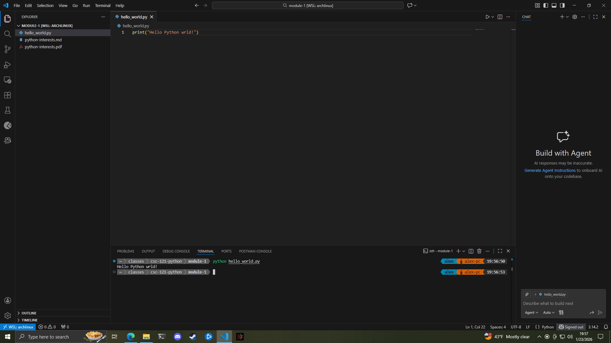

## Typo that generated an error

This typo generated an error because the `print` function was misspelled. This type of typo is known as a syntax error. It was typed as `pint`, which is not a valid function in Python, so the interpreter could not execute the code. 

## Type that did not generate an error

This typo did not generate an error because it was inside the string being passed to the `print` function. Strings are treated as literal text in Python, so whatever is typed inside the quotes is passed exactly as is, even if it contains a typo. 