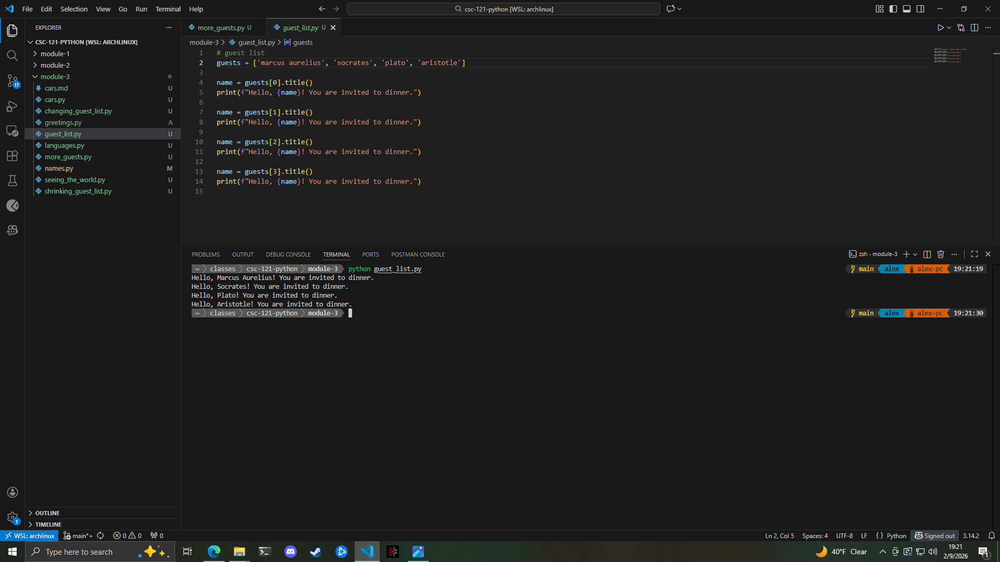

## 3-4. Guest List

## 3-8. My Updated List

For this one, I used the code from assignment 3-6. More Guests. The only difference between this assignment and the assignment in moodle, is that I kept the part where the list is changed because a guest wasn't able to make it to dinner. The list is sorted alphabetically before the final invitations are printed.  

